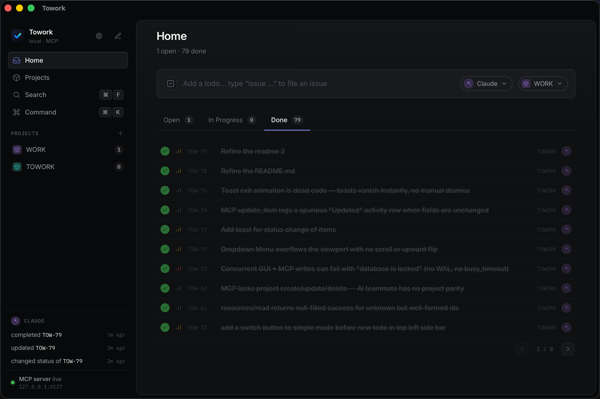

<div align="center">

# Towork

### A local-first desktop task manager where **AI is a first-class teammate**

You and Claude work the *same* projects, todos, and issues — Claude joins through an
embedded **MCP server**, not a bolted-on chat box. Everything lives in one local
SQLite file. No account, no cloud, no telemetry.

<br />


<br />



</div>

## Why Towork

Most task managers treat an assistant as a sidecar that *talks about* your work. Towork
makes the AI a teammate that *does* the work in the same surface you do:

- **One shared source of truth.** The GUI and the AI mutate the **same** SQLite
  database — no sync, no API round-trip, no second copy of your tasks.
- **Every change is attributed.** Mutations from the GUI are logged as **User**;
  mutations over MCP are logged as **AI** — so the activity log reads like a
  changelog of who did what.
- **The UI reacts to the AI in real time.** When Claude creates or updates an item
  over MCP, the running app **live-refreshes** (via a `towork:changed` event) —
  watch tasks move while the AI works.
- **Local-first and private.** A single SQLite file on your machine. No account,
  no cloud, no telemetry.
- **Built for the keyboard.** A command palette (`⌘K`), a distraction-free Simple
  Mode, and a dark "Data Buddy" design system.

## Download

Download the latest build for your platform. Each link points at the
**[latest release](https://github.com/wynn5a/towork/releases/latest)** channel:

[](https://github.com/wynn5a/towork/releases/latest)

| OS | Architecture | Package |
| --- | --- | --- |
| **macOS** | Apple Silicon (`arm64`) | [`.dmg`](https://github.com/wynn5a/towork/releases/latest/download/Towork_0.7.0_aarch64.dmg) |
| **macOS** | Intel (`x86_64`) | [`.dmg`](https://github.com/wynn5a/towork/releases/latest/download/Towork_0.7.0_x64.dmg) |
| **Windows** | `x64` | [`.msi`](https://github.com/wynn5a/towork/releases/latest/download/Towork_0.7.0_x64_en-US.msi) · [`.exe`](https://github.com/wynn5a/towork/releases/latest/download/Towork_0.7.0_x64-setup.exe) |
| **Linux** | `x86_64` | [`.AppImage`](https://github.com/wynn5a/towork/releases/latest/download/Towork_0.7.0_amd64.AppImage) · [`.deb`](https://github.com/wynn5a/towork/releases/latest/download/Towork_0.7.0_amd64.deb) · [`.rpm`](https://github.com/wynn5a/towork/releases/latest/download/Towork-0.7.0-1.x86_64.rpm) |

> Links use the `releases/latest/download/` channel. If a direct link 404s after a
> new version, the filename changed — grab it from the
> [latest release page](https://github.com/wynn5a/towork/releases/latest).

Prefer to build it yourself? See [Quick start](#quick-start) below.

## Stack

- **Frontend:** React 19 + TypeScript + Vite + Tailwind 4, React Router. Dark
  "Data Buddy" design system (`src/styles/`).
- **Backend:** Rust + Tauri 2, `rusqlite` (bundled SQLite), `serde`.
- **AI integration:** an embedded JSON-RPC 2.0 MCP server, over both HTTP and stdio.

## Quick start

**Prerequisites:** Node 20+ with `pnpm`, and a stable Rust toolchain (`cargo`).

```bash
pnpm install
pnpm tauri dev      # launches the desktop app (starts Vite automatically)
```

Other scripts:

```bash
pnpm build          # type-check + production web build
pnpm test           # Vitest + React Testing Library suite
pnpm tauri build    # package the desktop app (needs a full icon set; see below)
```

## Data

The SQLite database lives in the OS app-data dir under `com.towork.app/towork.db`
(e.g. `~/Library/Application Support/com.towork.app/towork.db` on macOS). It is
created and migrated on first launch.

## Keyboard

| Shortcut | Action |
| --- | --- |
| `⌘K` / `Ctrl+K` | Open the command palette |
| double-tap `Shift` | Toggle **Simple Mode** (distraction-free flat todo list) |
| `↑` / `↓` | Navigate items (Simple Mode) |
| `Enter` | Complete the focused item (Simple Mode) |
| `Esc` | Exit Simple Mode / close an editor |
| `⌘↵` | Save (in editors) |

## MCP integration

Towork exposes its data to AI clients over the Model Context Protocol (JSON-RPC
2.0), sharing the GUI's database. Mutations made over MCP are attributed to
**AI** in the activity log, and the running app **live-refreshes** when the AI
changes data (via a `towork:changed` event).

- **Tools:** `list_projects`, `list_items`, `create_item`, `update_item`,
  `complete_item`, `search_items`, `get_activity`
- **Resources:** `towork://projects`, `towork://project/{id}`, `towork://item/{id}`
- **Prompts:** `daily_review`, `plan_day`

### HTTP transport (starts with the app)

When the desktop app runs, it automatically starts an embedded MCP server on a
background thread. Point an HTTP-capable MCP client at it:

```
http://127.0.0.1:4127/      # POST JSON-RPC; GET returns a health check
```

Override the bind address with the `TOWORK_MCP_ADDR` environment variable.

Example client config:

```json
{
  "mcpServers": {
    "towork": { "url": "http://127.0.0.1:4127/" }
  }
}
```

### stdio transport

For clients that spawn their server as a subprocess (e.g. Claude Desktop), the
same binary also speaks MCP over stdio:

```json
{
  "mcpServers": {
    "towork": { "command": "/path/to/towork", "args": ["--mcp"] }
  }
}
```

During development: `cd src-tauri && cargo run -- --mcp`.
